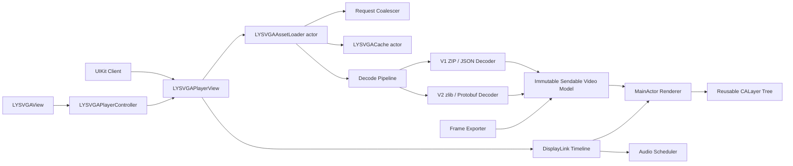
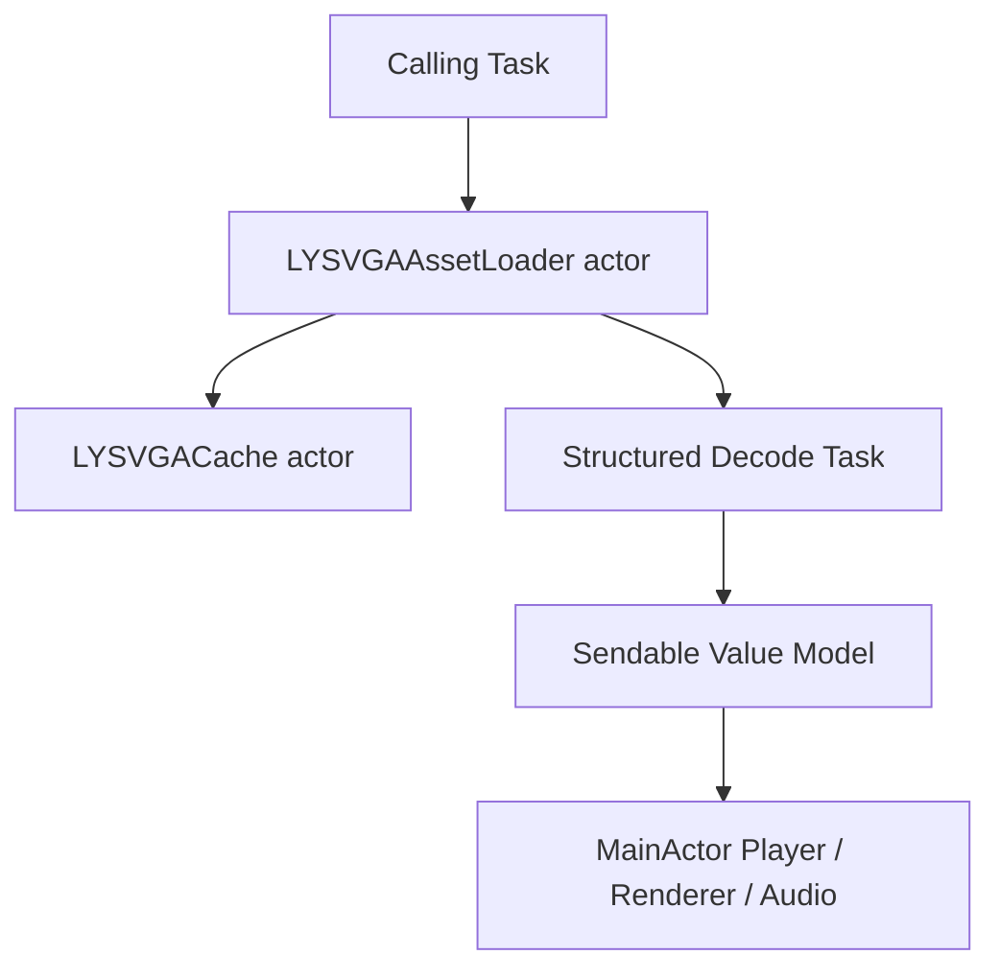

# LYSVGAPlayer 架构

## 目标与边界

LYSVGAPlayer 采用“统一数据模型 + 异步资源管线 + 主线程渲染内核”的架构。核心使用 UIKit 与 Core Animation，最低工具链为 Swift 6.2 与 Xcode 26，最低支持 iOS 16；SwiftUI 只作为适配层，不改变播放内核的生命周期与线程约束。

本仓库是独立 Swift Package，不依赖、不读取、不复制、不修改任何业务应用的源码、资源或构建配置。

当前阶段已实现统一数据模型、V1/V2 解码、异步资源加载、请求合并和内存/磁盘缓存。渲染、播放、音频和导出仍是后续设计边界，不代表已经实现。

## 总体架构



核心数据流：

```text
Source
  -> 缓存查询 / 同请求合并
  -> 格式识别
  -> 解压与解析
  -> 不可变统一模型
  -> 主线程构建可复用图层树
  -> DisplayLink 驱动逐帧属性更新与音频调度
```

## 模块职责

| 目录 | 职责 | 明确边界 |
| --- | --- | --- |
| `Public` | 已实现公开类型、错误、源与加载器 API | 不暴露内部解析器、缓存节点或渲染图层 |
| `Format` | 已实现文件识别、V1/V2 解码、数据校验与错误映射 | 不持有 UI、播放状态或缓存策略 |
| `Format/Protobuf` | 已提交固定 schema/Swift 生成代码并映射统一模型 | 生成对象不跨并发边界 |
| `Model` | 已实现 Video、Sprite、Frame、Shape、Transform、Matte、Audio 值模型 | 类型不可变并满足 `Sendable` |
| `Loading` | 已实现 URL、本地文件和 `Data` 加载，请求合并与缓存 | 不创建 UIKit 或 Core Animation 对象 |
| `Rendering` | 图层工厂、位图、矢量、遮罩、动态内容与画布布局 | 由 `MainActor` 隔离，不负责网络和解析 |
| `Playback` | DisplayLink 时钟、区间、循环、倒放、倍速与结束行为 | 只推进逻辑时间线，不解析资源 |
| `Audio` | 音频资源创建、区间调度、暂停恢复、循环与静音 | 与播放时钟同步，倒放不启动内嵌音频 |
| `SwiftUI` | `UIViewRepresentable` 和 `ObservableObject` 控制器 | 仅适配 UIKit 核心，兼容 iOS 16 |
| `Export` | 指定帧渲染、图片序列与 PNG 写入 | 复用统一模型，不依赖播放视图的实时状态 |

所有目录编译进唯一公开 Target `LYSVGAPlayer`，Package 不为内部边界增加额外公开 Product。

## 并发规则



- `LYSVGAPlayerView`、Renderer、`CALayer`、`CADisplayLink`、音频播放器和 Delegate 均限定在 `MainActor`。
- `LYSVGAAssetLoader` actor 负责加载任务与相同 URL 请求合并。
- `LYSVGACache` actor 负责内存 LRU、磁盘索引、容量与过期清理。
- 解压、JSON/Protobuf 解析采用结构化异步任务，并响应取消。
- 并发边界只传递 `Sendable` 输入和不可变结果；Protobuf 生成对象在解析任务内立即转换。
- 需要 `@unchecked Sendable` 的系统对象必须单独封装并记录线程安全依据，不得成为公开 API。
- Package 使用 Swift tools 6.2 与明确的 Swift 6 语言模式，采用默认的完整严格并发检查；工具链升级不改变 SwiftUI 的 iOS 16 兼容边界。

## 渲染层级

```text
LYSVGARootLayer
├── LYSVGASpriteLayer
│   ├── LYSVGABitmapLayer
│   ├── LYSVGAVectorLayer / CAShapeLayer
│   └── mask / matte layer
├── LYSVGASpriteLayer
└── Dynamic content layers
```

- 设置 Video 时一次构建图层树，播放期间复用，不逐帧重建完整层级。
- DisplayLink 使用时间戳计算逻辑帧；实际显示掉帧时直接追赶目标帧。
- 每帧只更新必要的 `opacity`、`frame`、`transform`、`path`、`contents` 与 `mask`。
- 位图按资源 Key 缓存，矢量路径按 Sprite/Frame 缓存。
- 画布布局完整映射 `UIView.ContentMode` 的缩放与对齐语义。
- 静音只将音量设为零，音频时间线仍继续；倒放不启动内嵌音频。
- 进入后台、离开窗口或释放时停止时钟和音频，并解除图层引用。

## 计划公开 API

- `LYSVGASource`、`LYSVGAVideo`、`LYSVGAError`
- `LYSVGAAssetLoader.load(_:cachePolicy:) async throws`
- `LYSVGAPlayerView` 与 `LYSVGAPlayerViewDelegate`
- `LYSVGARepeatMode`、`LYSVGAEndBehavior`、`LYSVGAPlaybackState`
- `LYSVGAPlayerController` 与 `LYSVGAView`
- `LYSVGAFrameExporter`
- 动态图片、远程图片、富文本、隐藏和 Drawing Handler 接口

所有公开类型使用 `LYSVGA` 前缀，以便与 Objective-C SVGAPlayer 共存。当前可用边界以源码和 README 的 Package 状态为准；渲染、播放、音频及导出名称仍不构成可用性承诺。
