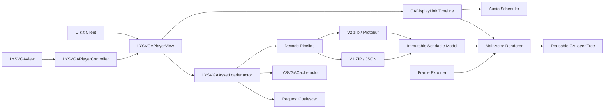
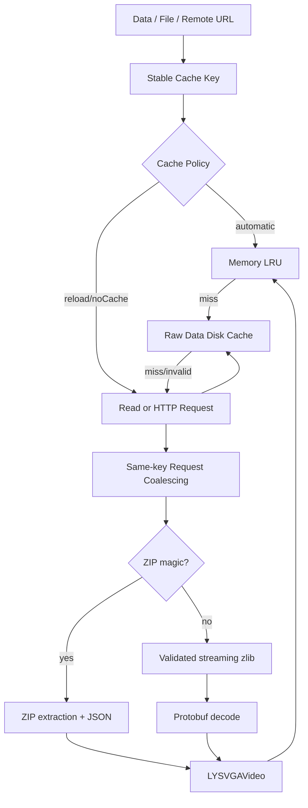
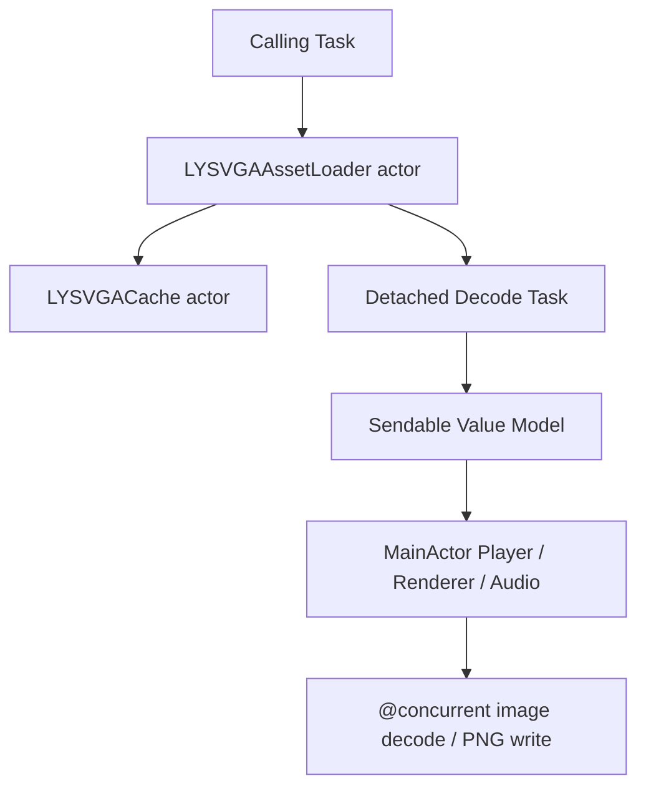
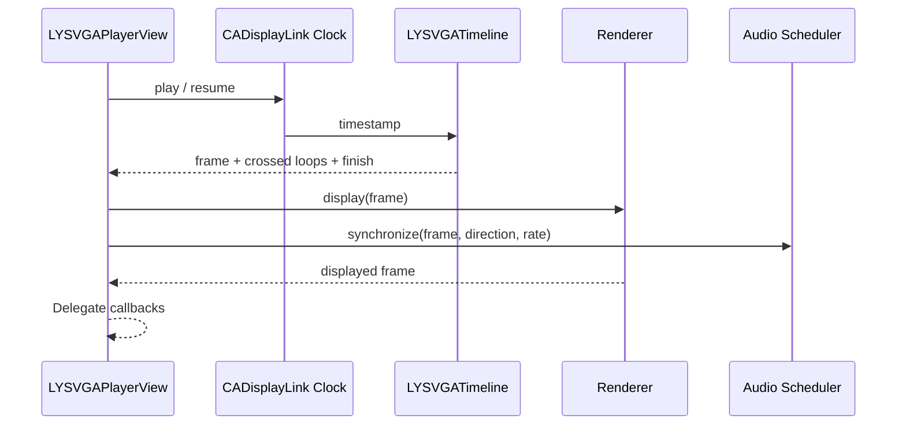

# LYSVGAPlayer 架构

## 目标与边界

LYSVGAPlayer 采用“统一 Sendable 数据模型 + actor 资源管线 + MainActor 渲染内核”的架构。核心使用 UIKit、Core Animation、ImageIO 与 AVFoundation；SwiftUI 只适配同一个 UIKit 播放器，不复制播放状态或渲染实现。

工具链基线为 Swift 6.2 / Xcode 26，语言模式为 Swift 6，最低系统为 iOS 16。Package 只有一个公开 Product `LYSVGAPlayer`，所有公开符号使用 `LYSVGA` 前缀。

## 总体架构



不支持 Mermaid 的阅读环境可按以下文本理解：

```text
Source -> request coalescing/cache -> format detection/decode
       -> immutable video model -> reusable CALayer tree
       -> CADisplayLink timeline -> renderer + audio scheduler
```

## 模块职责

| 目录 | 已实现职责 | 不负责 |
| --- | --- | --- |
| `Public` | 播放器、Delegate、源、缓存策略、错误与版本 | 解析器和内部图层公开化 |
| `Model` | Video、Sprite、Frame、Shape、Transform、Matte、Audio 值模型 | UIKit、网络和播放状态 |
| `Format` | 格式识别、V1/V2 解码、zlib 校验、资源映射 | 缓存与 UI |
| `Loading` | Data/文件/URL、请求合并、取消、内存和磁盘缓存 | 图像解码与渲染 |
| `Rendering` | 位图准备、SVG Path、图层树、matte、动态内容与布局 | 时间线和网络资源策略 |
| `Playback` | DisplayLink 时钟、范围、循环、倒放、倍速与结束行为 | 资源解析 |
| `Audio` | 音频创建、区间调度、定位、暂停恢复、静音与音量 | 全局 `AVAudioSession` |
| `SwiftUI` | `ObservableObject` 控制器与 `UIViewRepresentable` | 第二套播放器实现 |
| `Export` | 指定帧图片、PNG Data 与 PNG 序列写入 | 实时播放状态复用 |

## 资源加载与解析



`LYSVGAAssetLoader` 是 actor。相同缓存 Key 的并发调用共享底层读取/解码任务，但每个调用者拥有独立 waiter；取消一个 waiter 不会取消其他调用者，最后一个 waiter 取消时才终止共享任务。

缓存语义：

- `.automatic`：内存模型 -> 磁盘原始数据 -> 读取并解析，成功后回填两级缓存。
- `.reloadIgnoringCache`：跳过读取缓存，成功后更新内存和磁盘。
- `.memoryOnly`：只读取/写入内存模型。
- `.noCache`：不读取、不写入缓存。
- 磁盘缓存通过大小、TTL、访问时间和元数据校验管理；解码取消不会删除仍然有效的数据。

V2 zlib 使用流式解压并校验 CMF/FLG、字典标记、完整输入、Adler-32、尾随数据和 256 MiB 输出上限。ZIP 路径拒绝目录穿越和符号链接逃逸。

## 并发边界



- `LYSVGAVideo` 及其子模型是不可变 `Sendable` 值类型。
- Protobuf 生成对象只存在于解析任务内，完成后立即映射为统一模型。
- `LYSVGAPlayerView`、Renderer、`CALayer`、`CADisplayLink`、Delegate 和音频播放器限定在 `MainActor`。
- ImageIO 位图准备使用 `@concurrent`，只把内部不可变 `CGImage` 包装传回主线程。
- PNG 目录创建和文件写入使用 `@concurrent`，实际图层渲染仍在主线程。
- 动态远程图片任务可取消，并以 token 保证同 Key 最后请求获胜。

LYSVGAPlayer Target 使用 Swift 6 默认完整并发检查。对整个依赖图额外强制 `SWIFT_STRICT_CONCURRENCY=complete` 会触发 ZIPFoundation 0.9.20 内部可变全局变量诊断，这是外部依赖边界，需要上游修复或隔离编译设置。

## 图层树与逐帧渲染

```text
LYSVGARootLayer
└── canvasLayer (canvas coordinate system and contentMode transform)
    ├── LYSVGASpriteLayer
    │   ├── bitmapLayer
    │   ├── LYSVGAVectorLayer
    │   │   └── fixed CAShapeLayer pool
    │   ├── dynamicImageLayer
    │   └── dynamicTextLayer
    ├── LYSVGAMatteHostLayer
    │   ├── content sprite layers
    │   └── mask: reused matte sprite layer
    └── other sprite layers
```

安装 Video 时，Renderer 先在后台准备位图，再一次性构建全画布图层树。播放期间不重建完整层级，每帧只更新：

- `opacity`、layout、仿射变换；
- 位图 `contents` 和 clipPath mask；
- 矢量 path、fill、stroke、dash 与 keep-frame 索引；
- matte 可见性与动态内容；
- Drawing Handler，执行顺序在标准帧属性更新之后。

矢量层按 Sprite 的最大形状数量建立固定 `CAShapeLayer` 池。keep-frame 预先解析到最近有效形状帧，避免重复解析或逐帧创建层。

matte 源可以被多个不连续内容区间引用：第一次复用原 matte 图层，后续 host 创建同模型图层副本。缺失 matte 时被遮罩内容不会降级为无蒙版显示，而是隐藏。

## ContentMode

`LYSVGACanvasLayout` 完整映射 13 种 `UIView.ContentMode`：

| 类型 | 行为 |
| --- | --- |
| `.scaleToFill`、`.redraw` | 非等比铺满容器 |
| `.scaleAspectFit` | 等比完整显示并居中 |
| `.scaleAspectFill` | 等比铺满并居中，超出部分由 `clipsToBounds` 决定是否裁剪 |
| `.center` | 原尺寸居中 |
| `.top`、`.bottom`、`.left`、`.right` | 原尺寸按对应边居中对齐 |
| `.topLeft`、`.topRight`、`.bottomLeft`、`.bottomRight` | 原尺寸按对应角对齐 |

布局变化只更新 root/canvas 几何和变换，不重建视频内容图层。

## 播放时间线



DisplayLink 通过弱代理持有回调，避免 target 循环引用。Timeline 使用 timestamp 而不是 tick 次数计算逻辑帧；`allowsFrameSkipping` 开启时直接追赶目标帧，关闭时每次最多推进一个逻辑帧。

范围和方向被归一化为闭区间。循环模式为 `.once`、`.count(UInt)`、`.forever`；一次 tick 跨过多个循环边界时 Delegate 会收到实际数量。播放结束后按 `.clear`、`.holdStartFrame` 或 `.holdEndFrame` 更新画面。

回调可能重入播放器，所以播放器用 mutation revision 防止旧 tick 或旧异步安装覆盖 Delegate 中发生的新操作。

## 音频

Audio Scheduler 为模型中的 audio cue 创建 `AVAudioPlayer`，按 `startFrame...endFrame` 与 `startTime` 计算区间。定位进入音频区间时从相应偏移开始；暂停、恢复、倍速、循环和静音与视频时间线同步。

- `isMuted` 只影响有效音量，不暂停音频时钟。
- `audioVolume` 钳制到 `0...1`。
- 倒放不启动音频。
- 库不调用 `AVAudioSession.setCategory` 或 `setActive`。

## 动态内容

动态 Key 通过统一标准化处理，可使用原始 Sprite Key，也可移除 `.matte`、`.vector`、`.png`、`.jpg`、`.jpeg`、`.webp`、`.gif` 后使用。动态隐藏覆盖位图、矢量、文本、绘制回调以及作为 matte 副本的图层。

动态富文本在 Sprite layout 内居中；动态图片替换原位图；Drawing Handler 在每帧标准更新后执行，并有重入保护。远程图片验证 HTTP 响应和状态码，支持 caller cancellation、覆盖旧请求和播放器释放清理。

## SwiftUI

`LYSVGAPlayerController` 是 `@MainActor ObservableObject`，持有唯一 `LYSVGAPlayerView` 并转发播放器 API。`LYSVGAView` 只负责把这个实例放入 SwiftUI 层级并同步 `contentMode`、`clipsToBounds`，因此 SwiftUI 视图重算不会创建第二套播放时间线。

适配层使用 iOS 16 可用的 `ObservableObject/@Published`，不依赖 iOS 17 Observation。

## 导出

`LYSVGAFrameExporter` 初始化时准备并持有同一个 Renderer。单帧导出按请求尺寸、scale 与 contentMode 布局后绘制 `UIImage`，PNG Data 在内存编码，PNG 序列逐帧渲染并并发写入文件。

导出校验帧范围、有限正尺寸、scale、文件 URL、前缀和取消；输出限制为单边 16384 像素、总计 64 MP。

## 生命周期清理

播放器监听应用 inactive/background/active 通知并跟踪 Window 分离原因。多个中断原因可叠加，只有全部解除且中断前确实处于播放状态时才自动恢复。

`clear()` 会取消动态请求、使时钟失效、清理音频、移除 Renderer root layer、释放 Video/Timeline 并移除通知。播放器释放时远程动态图片协调器也会取消剩余任务。

## 验证边界

- 单元测试覆盖格式、zlib 边界、缓存取消、SVG Path、matte、clipPath、keep-frame、全部 contentMode、时间线、生命周期、音频调度、动态内容、SwiftUI 和导出。
- 像素快照覆盖 V1/V2 位图、矢量和 matte，固定为 128 x 128、scale 1、sRGB 并使用通道容差。
- Demo 已在 iOS Simulator 运行 V1、V2、matte 和音频公开样例。
- Benchmark 可输出解析、首帧、连续渲染、CPU、内存与帧预算 JSON。
- 没有同机同配置的上游 2.5.8 JSON 前，不判定 110%/115% 性能门槛。
- iOS 16 deployment target 可通过构建验证；真实 iOS 16 行为仍需 iOS 16 Runtime 或设备。
- 生产兼容性最终需要业务方把未提交素材放入 `TestAssets/Local/` 完成验收。
